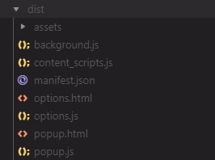

# React Extension Starter with Typescript

## Minimal react frontend for browser (Chrome/Firefox) extension with basic cross-browser API and essential webpack setup

This project was created for myself to learn webpack and the innards of react compilation.
However, it's also meant for those who wants to quickly setup a browser extension without all the bloat from create-react-app eject or other boilerplates.
To reduce bloat, I only included packages that's essential for react, cross-browser api, and webpack loaders that I deem essential for frontend (html, css, font and assets loading).

### What this has

- Webpack compilation
  - React with babel loader
  - HTML loader
  - CSS & postcss loader
  - Image and SVG loader
  - Font loader
- Cross-browser API via webextension-polyfill
- Port & one-time messaging example
- Scraping content page example

### Does **NOT** have

- Browser launch with autoreload
- Extension packaging
- Jest tests

### Modifying the files

Simply remove or add entries in the build object in webpack.config.js.

If you remove components, such as 'devtools' folder, remember to update the 'public/manifest.json' entry.

### Production build structure



### Production

```bash
npm run build
```

### Development: will watch for changes for compile but you need to manually reload in browser

```bash
npm run build-dev
```

- Notes: To load devtools sourcemap in development mode, disable adblocker.
